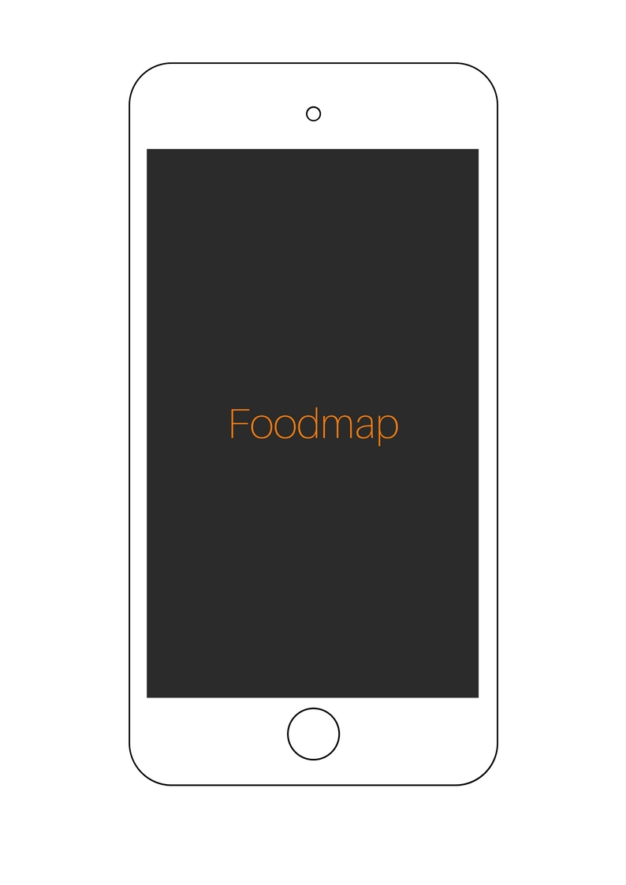
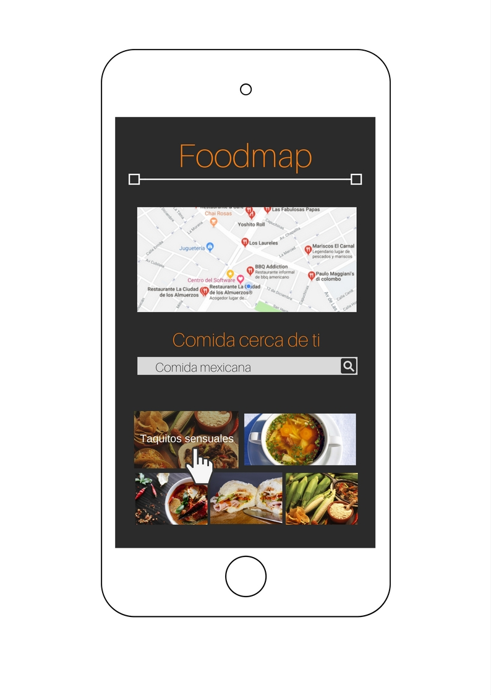

# Foodmap

* **Track:** _Common Core_
* **Curso:** _Crea tu propia red social_
* **Unidad:** _Agiliza tu desarrollo _

***

El presente reto pone a prueba nuestros conocimientos sobre **jQuery**, manejo del DOM y eventos.

## Objetivo

El reto consiste en crear una app **Foodmap**, que a través de un input pueda filtrar los restaurantes que se encuentran cerca del usuario. La estructura de la que nos podemos guiar es la siguiente:

## Detalles adicionales

* Dentro del repositorio encontrarás un archivo index.html el cual contiene la estructura sobre la que se realizó el reto.
* En la carpeta css un archivo main.css donde está todos los estilos aplicados y el grid que se creó para este reto. Los cuales están enlazados con mi HTML.
* En assets también se encuentra la carpeta images donde se encuentran todos las imágenes usadas para completar este reto.
* Por último el README.md explicando el contenido de mi repositorio.
* Dentro de la rama **gh-pages** un link donde se podrá visualizar el resultado final.

## Autor

* Gabriela Mamani Flores.